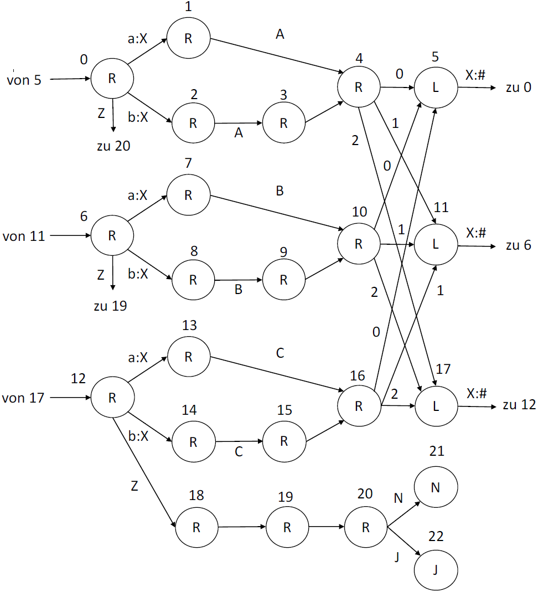

Gegeben sei der reguläre Ausdruck b*(ab*ab*ab*)* und die TM4 aus der Abbildung, die die Arbeitsweise eines jeden 3-Zustands-DFA simulieren kann.

=== a. Zeichnen Sie dem regulären Ausdruck entsprechenden DFA mit 3 Zuständen und geben Sie die Zustandstabelle an.

plantuml::uebung6/exercise02a.puml["exercise02a.puml",svg]

|===
|Nr |Typ |a |b

|0
|true
|1
|0

|1
|false
|2
|1

|2
|false
|0
|2
|===

=== b. Bestimmen Sie die Abfolge der Zeichen auf dem Band für das Wort baaab ehe die Maschine startet.

 #baaab A10B21C02 ZJNN#

baaab ist das Wort
Jeder Zustand Wird mit dem Alphabet durch numeriert (ABC...Y).
Nach dem Zustand werden die Uebergaenge aus der Tabelle entnommen.
Leerzeichen sind nur fuer das verstaendnis, nicht tatsaechlich auf dem Band.

=== c. Geben Sie den Pfad aller Zustandswechsel in Tabellenform an.

#
baaab A10 B21 C02 ZJNN
# S0 - S2 b:X

#
##b##aaab A10 B21 C02 ZJNN
# S0 - S2 b:X

#
Xaaab ##A##10 B21 C02 ZJNN
# S2 - S3 A

#
Xaaab A##1##0 B21 C02 ZJNN
# S3 - S4

#
Xaaab A1##0## B21 C02 ZJNN
# S4 - S5

#
\#aaab A10 B21 C02 ZJNN
# S5 - S0 X:#

#
##X##aab A10 B21 C02 ZJNN
# S0 - S1 a:X

#
Xaab ##A##10 B21 C02 ZJNN
# S1 - S4 A

#
Xaab A##1##0 B21 C02 ZJNN
# S4 - S11 1

#
\#aab A10 B21 C02 ZJNN
# S11 - S6 X:#

#
##X##ab A10 B21 C02 ZJNN
# S6 - S7 a:X

#
Xab A10 ##B##21 C02 ZJNN
# S7 - S10 B

#
Xab A10 B##2##1 C02 ZJNN
# S10 - S17 2

#
\#ab A10 B21 C02 ZJNN
# S17 - S12 X:#

#
##X##b A10 B21 C02 ZJNN
# S12 - S13 a:X

#
Xb A10 B21 ##C##02 ZJNN
# S13 - S16 C

#
Xb A10 B21 C##0##2 ZJNN
# S16 - S5 0

#
\#b A10 B21 C02 ZJNN
# S5 - S0 X:#

#
##X## A10 B21 C02 ZJNN
# S0 - S2 b:X

#
X ##A##10 B21 C02 ZJNN
# S2 - S3 A

#
X A##1##0 B21 C02 ZJNN
# S3 - S4

#
X A1##0## B21 C02 ZJNN
# S4 - S5 0

#
# A10 B21 C02 ZJNN
# S5 - S0 X:#

#
A10 B21 C02 ##Z##JNN
# S0 - S20 Z

#
A10 B21 C02 Z##J##NN
# S20 - S22 J

