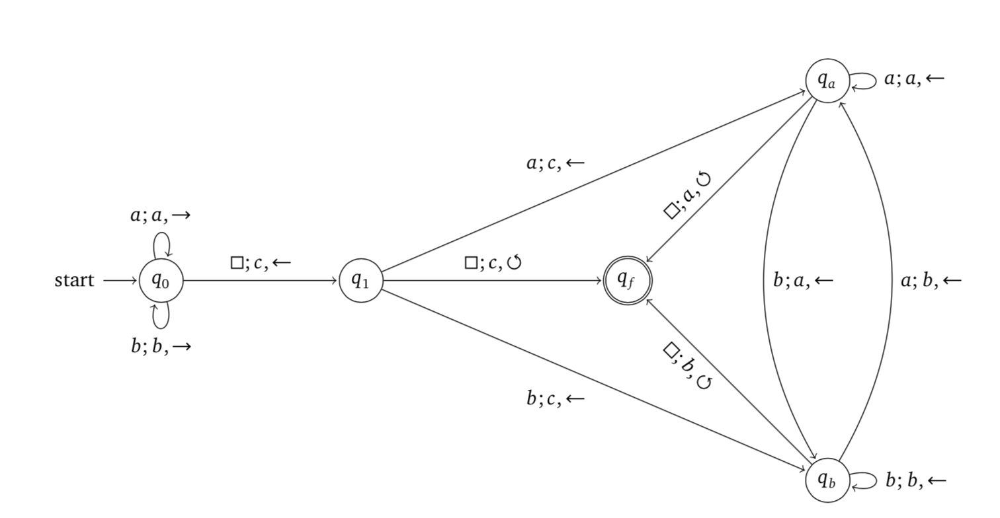

Gegeben sei die folgende Turingmaschine TM1.

=== a. Beschreiben Sie informell, was TM1 tut.

Annahme: # gleich leere Box

Eingabe abba

latexmath:[q_0]: läuft nach rechts bis #

#
abba
#

latexmath:[q_0 - q_1]: ersetz # durch c und aendert Leserichtung nach links

#
abbac
#

latexmath:[q_1 - q_a]: ersetz a durch c

#
abbcc
#

latexmath:[q_a - q_b]: ersetz b durch a

#
abacc
#

latexmath:[q_b - q_b]: liest ueber b

#
abacc
#

latexmath:[q_b - q_a]: ersetz a durch b

#
bbacc
#

latexmath:[q_a - q_f]: ersetz # durch a

#
abbacc
#

Algorithmus fuegt links zwei c hinzu und schieb das eingegebene wort eine position nach links.

=== b. Konvertieren Sie das Modell in ein äquivalentes Modell nach Marvin Minsky.

plantuml::uebung7/exercise01.puml["uebung7/exercise01.puml",svg]

=== c. Ist das Modell Turing vollständig?

ja, es ist Turing vollsändig, da es möglich das Modell nach Marvin Minsky zu konvertieren.

=== d. Notieren Sie die Unterschiede zwischen den beiden Formalisierungen.

Angenommen der HTWG steht eine Universelle Turingmaschine (UTM)
zur Verfügung. Sie versteht auf dem Band Informationen, die sich nach
dem folgenden Format zusammensetzen:

`Zustände Zustandswechsel Wort`

Die Zustände setzen sich aus

• Zustandsnummer und Zustandsart und die Zustandswechsel setzen sich aus
• aktuellem Zustand, nächstem Zustand, dem Eingangssymbol und Ausgangssymbol zusammen.

Lösung:

=== e. Encodieren Sie die Turingmaschine als Eingang für diese UTM.
