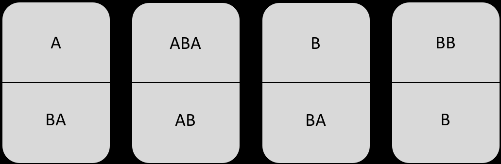
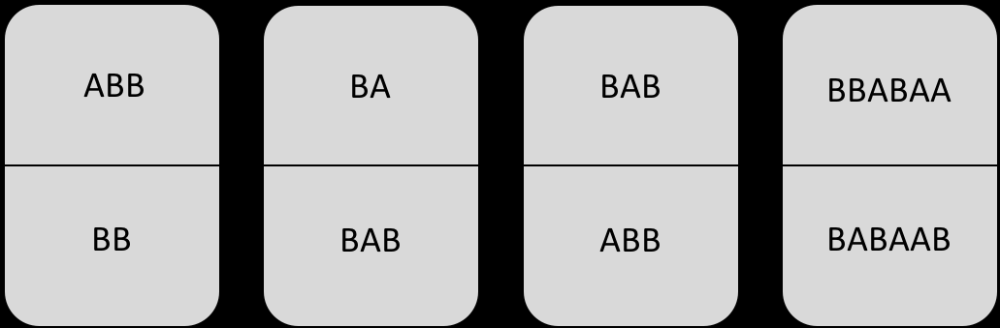

Finden Sie jeweils eine Lösung zum Post‘schen Korrespondenzproblem
oder zeigen Sie, dass es keine Lösung gibt.

=== a.

nummerierung von links nach rechts 0 - 3
1,2,3 koennen der Anfang sein 0, 3 koennen ein Ende sein.

1 ist ziemlich schlecht, da die untere ebene als n'chstes ein a erfordert, aber nur 1 selbst mit einem a beginnt.

31321424

=== b.

